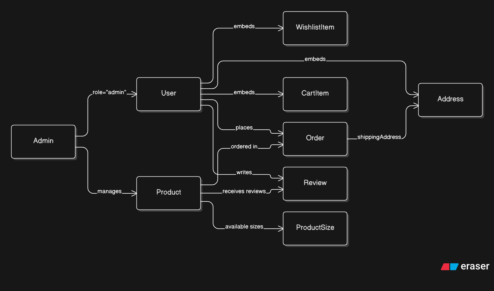

# Trendora – Full Stack E-Commerce Platform

Trendora is a modern **full-stack e-commerce platform** built using the **MERN Stack** with secure authentication, admin management, product management, cart, wishlist, order system, payment integration, and a responsive user experience.

It is designed with a **production-oriented architecture** using authentication, security middleware, validation, cloud image uploads, and scalable backend patterns.

---

## 🚀 Features

### 👤 Authentication & Authorization

* User Registration & Login
* JWT Authentication
* Cookie-based authentication
* Google OAuth Login
* OTP Verification
* Password Reset Flow
* Role-based Authorization (Admin/User)

### 🛍️ E-Commerce Features

* Browse Products
* Product Details Page
* Category-based Products
* Search & Filtering
* Add to Cart
* Wishlist Management
* Place Orders
* Product Reviews & Ratings

### 👨‍💼 Admin Features

* Admin Dashboard
* Add/Edit/Delete Products
* User Management
* Order Management
* Product Management

### 💳 Payment Integration

* Razorpay Payment Gateway Integration
* Secure Checkout Experience

### ☁️ Media Uploads

* Product Image Upload using **Cloudinary**
* Profile Image Upload using **Cloudinary**

### 🔒 Security Features

* JWT Authentication
* Helmet for HTTP Security
* CSRF Protection
* Rate Limiting
* Secure Cookies
* Request Validation using Joi

### ⚡ Performance & UX

* Lazy Loaded Routes
* Responsive UI
* Toast Notifications
* Loading States
* Reusable Components
* Protected Routes

---

## 🛠️ Tech Stack

### Frontend

* React.js
* Vite
* React Router DOM
* Tailwind CSS
* Axios
* React Hook Form
* Zod Validation
* React Toastify
* React-Icons

### Backend

* Node.js
* Express.js
* MongoDB
* Mongoose
* JWT Authentication
* Joi Validation
* Nodemailer
* Google OAuth
* Razorpay
* Twilio

### Cloud & Storage

* Cloudinary
* MongoDB Atlas

---

## 📂 Project Structure

```bash
Trendora/
│── CLIENT/
│   ├── src/
│   │   ├── api/
│   │   ├── assets/
│   │   ├── components/
│   │   ├── context/
│   │   ├── providers/
│   │   ├── routes/
│   │   └── schemas/
│
│── SERVER/
│   ├── src/
│   │   ├── config/
│   │   ├── controllers/
│   │   ├── middleware/
│   │   ├── models/
│   │   ├── routes/
│   │   └── services/
│   │   ├── uploads/
│   │   └── utils/
│   │   └── validations/
```

---

## ⚙️ Installation & Setup

### 1. Clone the Repository

```bash
git clone <your-repository-url>
cd trendora
```

### 2. Install Dependencies

#### Frontend

```bash
cd CLIENT
npm install
```

#### Backend

```bash
cd SERVER
npm install
```

---

## 🔑 Environment Variables

Create a `.env` file inside the `SERVER` folder.

### Backend `.env`

```env
PORT=5000
MONGO_URI=your_mongodb_uri
JWT_SECRET=your_secret_key
JWT_REFRESH_SECRET=your_refresh_secret
CLIENT_URL=http://localhost:5173

CLOUDINARY_CLOUD_NAME=your_cloud_name
CLOUDINARY_API_KEY=your_api_key
CLOUDINARY_API_SECRET=your_api_secret

GOOGLE_CLIENT_ID=your_google_client_id

RAZORPAY_KEY_ID=your_razorpay_key
RAZORPAY_SECRET=your_razorpay_secret

EMAIL_USER=your_email
EMAIL_PASS=your_password

TWILIO_ACCOUNT_SID=your_twilio_sid
TWILIO_AUTH_TOKEN=your_twilio_auth_token
TWILIO_PHONE_NUMBER=your_phone_number
```

---

## ▶️ Run the Project

### Start Backend

```bash
cd SERVER
npm start
```

### Start Frontend

```bash
cd CLIENT
npm run dev
```

---

## 🗄️ Database Design

The application uses MongoDB with a hybrid approach of embedding and referencing.

### Database Schema Diagram



### Relationships

* User → Orders (1:N)
* User → Reviews (1:N)
* Admin → Products (1:N)
* Product → Reviews (1:N)
* Product → Orders (1:N)
* User → Cart Items (Embedded)
* User → Wishlist Items (Embedded)
* User → Addresses (Embedded)
* Order → Shipping Address (Embedded)

---

## 🔗 API Highlights

### Authentication APIs

* Register User
* Login User
* Google Login
* Logout User
* OTP Verification

### Product APIs

* Get Products
* Add Product
* Update Product
* Delete Product

### Cart APIs

* Add to Cart
* Remove from Cart
* Update Quantity

### Order APIs

* Place Order
* Get User Orders
* Admin Manage Orders

### Review APIs

* Add Review
* Update Review
* Delete Review

---

## 🧪 Future Improvements

* AI Product Recommendation System
* Real-Time Order Tracking using Socket.IO
* Advanced Product Search
* Analytics Dashboard
* Redis Caching
* Unit Testing using Jest
* CI/CD Pipeline
* PWA Support

---

## 📌 Why Trendora?

Trendora was built to simulate a **real-world e-commerce application** with production-grade practices such as:

* Secure authentication & authorization
* Scalable backend architecture
* Cloud image handling
* Payment integration
* Input validation & security middleware
* Admin management system

---

## 👨‍💻 Author

**Gauri Shankar**

* MERN Stack Developer
* Full Stack Development Enthusiast
* Interested in Generative AI & Scalable Web Applications

---

## ⭐ Support

If you found this project useful, consider giving it a **star** on GitHub ⭐
