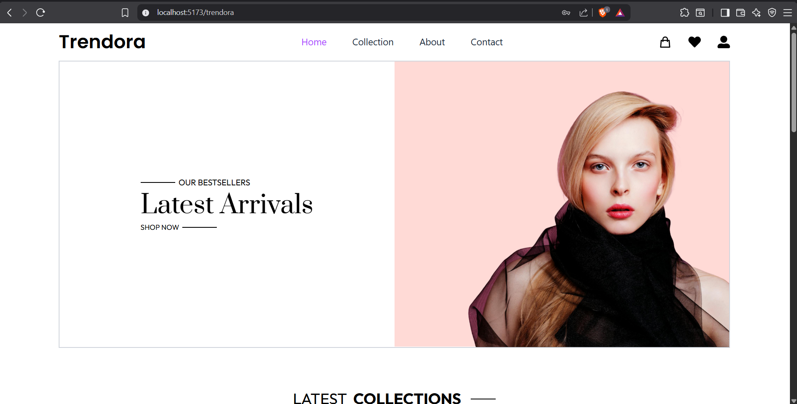
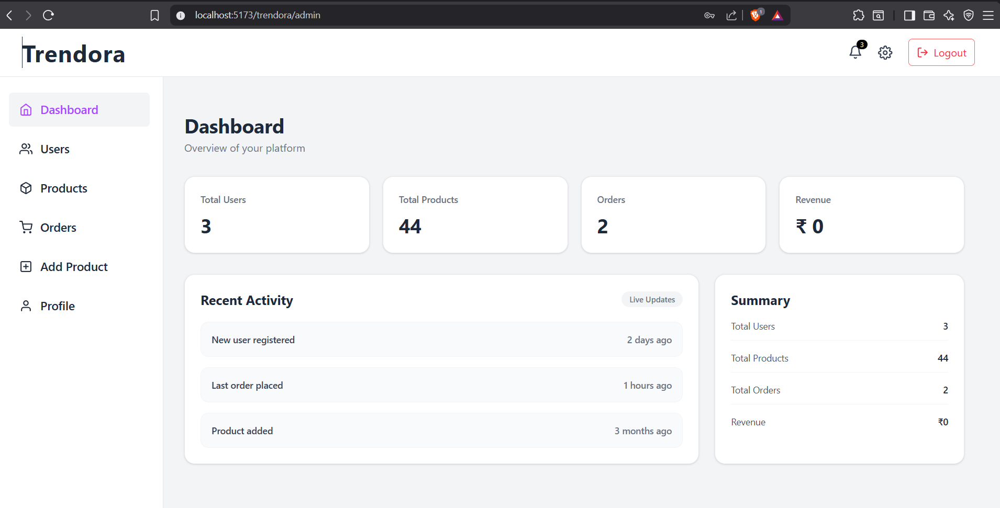
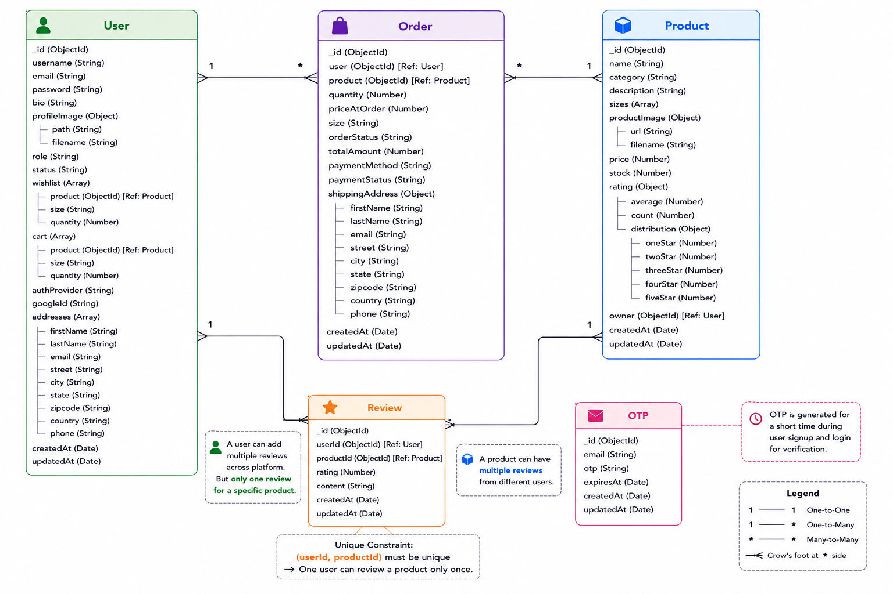

# 🛍️ Trendora – Full Stack E-Commerce Platform

Trendora is a modern **full-stack e-commerce platform** built using the **MERN Stack** with secure authentication, admin management, product management, cart, wishlist, order management, payment integration.

The application follows a **production-oriented architecture** with scalable backend patterns, secure authentication, validation, cloud image storage, and security best practices.

---

# 🚀 Features

## 👤 Authentication & Authorization

- User Registration & Login
- JWT Authentication
- Cookie-Based Authentication
- Google OAuth Login
- OTP Verification
- Password Reset Flow
- Role-Based Authorization (Admin/User)

---

## 🛍️ E-Commerce Features

- Browse Products
- Product Details Page
- Category-Based Products
- Product Search & Filtering
- Add to Cart
- Wishlist Management
- Place Orders
- Product Reviews & Ratings

---

## 👨‍💼 Admin Features

- Admin Dashboard
- Product Management
  - Add Products
  - Edit Products
  - Delete Products
- User Management
- Order Management

---

## 💳 Payment Integration

- Razorpay Payment Gateway
- Secure Checkout Experience

---

## ☁️ Media Uploads

- Product Images using Cloudinary
- Profile Images using Cloudinary

---

## 🔒 Security Features

- JWT Authentication
- Helmet Security
- CSRF Protection
- Rate Limiting
- Secure Cookies
- Request Validation using Joi

---

## ⚡ Performance & User Experience

- Lazy Loaded Routes
- Responsive UI
- Toast Notifications
- Loading States
- Reusable Components
- Protected Routes

---

# 🛠️ Tech Stack

## Frontend

- React.js
- Vite
- React Router DOM
- Tailwind CSS
- Axios
- React Hook Form
- Zod
- React Toastify
- React Icons

---

## Backend

- Node.js
- Express.js
- MongoDB
- Mongoose
- Multer
- Csurf
- Helmet
- Bcrypt
- JSON Web Token (JWT)
- Express Rate Limit
- Joi
- Nodemailer
- Google OAuth
- Razorpay
- Twilio
- Validator

---

## Cloud & Storage

- Cloudinary
- MongoDB Atlas

---

# 📂 Project Structure

```text
Trendora
│
├── client
│   └── src
│       ├── api
│       ├── assets
│       ├── components
│       ├── context
│       ├── pages
│       ├── providers
│       ├── routes
│       ├── schemas
│       ├── App.jsx
│       ├── index.css
│       └── main.jsx
│
└── server
    └── src
        ├── config
        ├── controllers
        ├── middleware
        ├── models
        ├── routes
        ├── services
        ├── uploads
        ├── utils
        └── validations
```

---

# ⚙️ Installation & Setup

## 1. Clone the Repository

```bash
git clone https://github.com/guptamarcos/Trendora.git

cd Trendora
```

---

## 2. Install Dependencies

### Frontend

```bash
cd client

npm install
```

### Backend

```bash
cd server

npm install
```

---

# 🔑 Environment Variables

## Frontend (`client/.env`)

```env
VITE_OAUTH_CLIENT_ID=
VITE_OAUTH_CLIENT_SECRET=
VITE_RAZORPAY_KEY_ID=
VITE_BACKEND_URL=
```

---

## Backend (`server/.env`)

```env
PORT=

MONGO_DB_URL=

TOKEN_SECRET=
SIGNED_COOKIE_SECRET=

CLIENT_URL=

CLOUD_NAME=
CLOUDINARY_API_KEY=
CLOUDINARY_API_SECRET=

EMAIL_USER=
EMAIL_PASS_KEY=

SMS_ACCOUNT_SID=
SMS_AUTH_TOKEN=
SMS_PHONE_NUMBER=
MY_PHONE_NUMBER=

OAUTH_CLIENT_ID=
OAUTH_CLIENT_SECRET=

RAZORPAY_API_KEY=
RAZORPAY_KEY_SECRET=
```

---

# ▶️ Running the Project

## Start Backend

```bash
cd server

npm start
```

---

## Start Frontend

```bash
cd client

npm run dev
```

---

# 📸 Screenshots

## Home Page



---

## Admin Dashboard



---

## Database Schema




# 🔗 API Highlights

## 🔐 Authentication APIs

- Register User
- Login User
- Google Login
- Logout User
- Verify OTP
- Resend OTP

---

## 👤 User APIs

- Get User Profile
- Update Profile Information
- Update Password
- Update Profile Avatar

---

## 🛍️ Product APIs

- Get All Products
- Get Product Details
- Get Latest Collections
- Get Best Sellers
- Get Related Products

---

## 🛒 Cart APIs

- Get Cart Items
- Add Item to Cart
- Remove Item from Cart

---

## ❤️ Wishlist APIs

- Get Wishlist Items
- Add Item to Wishlist
- Remove Item from Wishlist

---

## ⭐ Review APIs

- Get Product Reviews
- Add Review
- Delete Review

---

## 📦 Order APIs

- Place Order
- Get User Orders
- Cancel Order

---

## 💳 Payment APIs

- Create Razorpay Order
- Verify Payment Signature

---

## 🛡️ Security APIs

- Generate CSRF Token

---

## 👨‍💼 Admin APIs

- Get Dashboard Analytics
- Get All Users
- Get All Products
- Get All Orders
- Create Product
- Update Product
- Update Order Status
- Delete User
- Delete Product

---

# 🧪 Future Improvements

- Add responsiveness in it 
- AI Product Recommendation System
- Real-Time Order Tracking (Socket.IO)
- Advanced Product Search
- Analytics Dashboard
- Redis Caching
- Unit Testing (Jest)
- CI/CD Pipeline
- Progressive Web App (PWA)

---

# 📌 Why Trendora?

Trendora was built to simulate a **real-world production-ready e-commerce application** by implementing industry-standard practices such as:

- Secure Authentication & Authorization
- Scalable Backend Architecture
- Cloud-Based Image Management
- Secure Payment Integration
- Validation & Security Middleware
- Complete Admin Management System

---

# 👨‍💻 Author

**Gauri Shankar**

- MERN Stack Developer
- Full Stack Development Enthusiast
- Interested in Generative AI & Scalable Web Applications

---

# ⭐ Support

If you found this project helpful, consider giving it a **⭐ Star** on GitHub.

Your support is greatly appreciated!